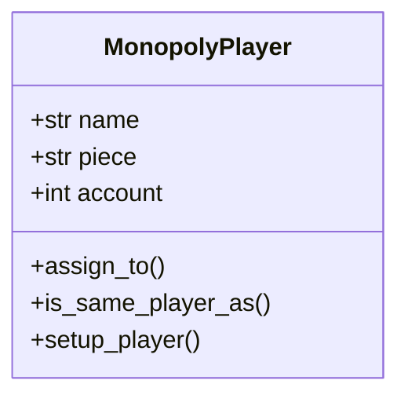

# Monopoly

A description of Monopoly, version 1.

## Class diagram

## MonopolyPlayer

A class to model a Monopoly player.

### Constructor

`__init__()`
: Constructor for objects of class MonopolyPlayer.
Initialises the `name`, `piece`, and `account` of the object to the default
values.

### Instance variables

*Note all methods have associated accessor and mutator methods.*

`name`
: **(str)** the Monopoly player's name.

`piece`
: **(str)** the Monopoly Player's game piece.

`account`
: **(int)** the Monopoly Player's bank account.

### Instance methods

`assign_to(a_name: str, a_piece: str, an_account: int)`
: Assigns the receiver to a player.
Sets the `name` of the receiver to the value of the argument `a_name`.
Sets the `piece` of the receiver to the value of the argument `a_piece`.
Sets the `account` of the receiver to the value of the argument `an_account`.

`describe()`.
: Prints the `name`, `piece`, and `account` of the receiver.

`is_same_player_as(a_player: MonopolyPlayer)`.
: Returns true if the receiver is equivalent to (has the same state as) the argument `a_player`, otherwise false is returned.
