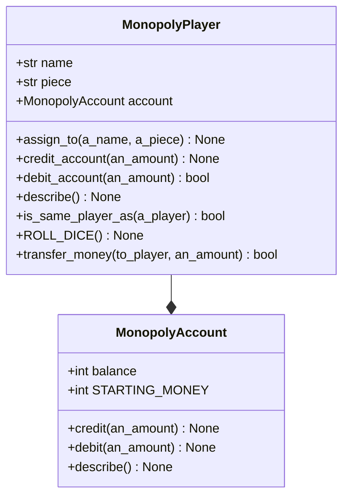

# Monopoly

A description of Monopoly, version 2.

Goals
: Implementing `MonopolyAccount` and updating `MonopolyPlayer`.

## Class diagram

## MonopolyAccount

A class to model a Monopoly player's bank account.

### Constructor

`__init__()`
: Constructor for objects of class Account.
Initialises the balance to the value of the class variable STARTING_MONEY

### Class variables

**(int)** `STARTING_MONEY`

### Instance variables

**(int)** `_balance`

### Instance methods

`credit(an_amount: int) : None`
: Credits the receiver with the value of the argument an_amount.
: @param, an_account, int
: @return, None

`debit(an_amount: int) : bool`
: If the balance of the receiver is equal to or greater than the argument an_amount, the balance of the receiver is debited by an_amount, and the method returns true, otherwise false is returned.
: @param, an_account, int
: @return, bool

`describe() : None`
: Prints the `balance` of the receiver.
: @return, None

`get_balance() : int`
: Returns the balance of the receiver
: @returns, int

`set_balance() : int`
: Sets the balance of the receiver to the value of the argument a_balance.
: @param, a_balance, int
: @returns, None

## MonopolyPlayer

A class to model a Monopoly player.

### Constructor

`__init__()`
: Constructor for objects of class MonopolyPlayer.
Initialises the `name` and `piece` to the default values.
Initialises and assigns a new Account object to `account`.

### Instance variables

**(str)** `name`

**(str)** `piece`

**(int)** `account`

### Class methods

`ROLL_DIE() : None`
: Simulates a player rolling the dice.
Prints the sum of the dice roll.

### Instance methods

`assign_to(a_name: str, a_piece: str, an_account: int) : None`
: Assigns the receiver to a player.
Sets the `name` of the receiver to the value of the argument `a_name`.
Sets the `piece` of the receiver to the value of the argument `a_piece`.
Sets the `account` of the receiver to the value of the argument `an_account`.

`credit_account(an_amount) : None`
: Credits the receiver's account with the value of the argument `an_amount`.

`debit_account(an_amount) : bool`
: If the balance of the receiver's account is equal to or greater than the argument `an_amount`, the balance of the receiver's account is debited by `an_amount`, and the method returns true, otherwise false is returned.

`describe() : None`.
: Prints the `name`, `piece`, and `account` of the receiver.

`is_same_player_as(a_player: MonopolyPlayer) : bool`.
: Returns true if the receiver is equivalent to (has the same state as) the argument `a_player`, otherwise false is returned.

`transfer_money(a_player, an_amount) : bool`
: If the balance of the receiver's account is equal to or greater than the argument `an_amount`, the balance of the receiver's account is debited by `an_amount`.
The argument `a_player` is then credited by `an_amount` and the method returns true, otherwise false is returned.
