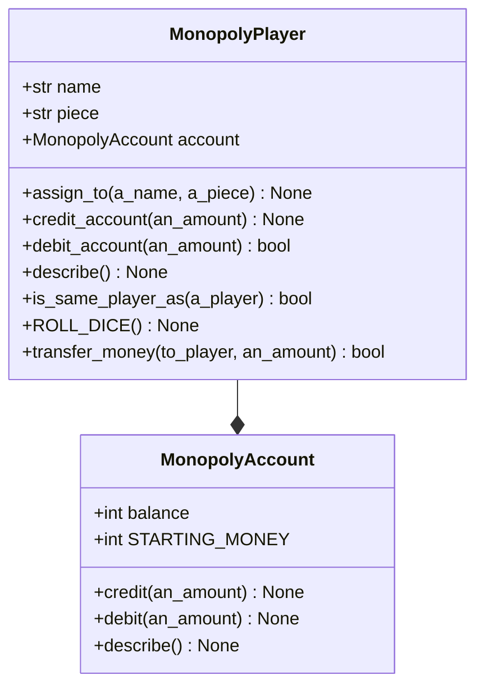

# Monopoly

A description of Monopoly, version 3.

Goal
: Implementing `Banker` and `BankerAccount`.

## Class diagram

## MonopolyBanker

A class to model a Monopoly Banker.

### Constructor

`__init__()`
: Constructor for objects of class MonopolyBanker.
Initialises the `name` to "Banker", `piece` to "None", and `account` to new `MonopolyBankerAccount` object.

### Instance variables

*Note all methods have associated accessor and mutator methods.*

`name`
: **(str)** the Monopoly player's name.

`piece`
: **(str)** the Monopoly Player's game piece.

`account`
: **(int)** the Monopoly Player's bank account.

### Class methods

`ROLL_DIE() : None`
: Simulates a player rolling the dice.
Prints the sum of the dice roll.

### Instance methods

`assign_to(a_name: str, a_piece: str, an_account: int) : None`
: Assigns the receiver to a player.
Sets the `name` of the receiver to the value of the argument `a_name`.
Sets the `piece` of the receiver to the value of the argument `a_piece`.
Sets the `account` of the receiver to the value of the argument `an_account`.

`credit_account(an_amount) : None`
: Credits the receiver's account with the value of the argument `an_amount`.

`debit_account(an_amount) : bool`
: If the balance of the receiver's account is equal to or greater than the argument `an_amount`, the balance of the receiver's account is debited by `an_amount`, and the method returns true, otherwise false is returned.

`describe() : None`.
: Prints the `name`, `piece`, and `account` of the receiver.

`is_same_player_as(a_player: MonopolyPlayer) : bool`.
: Returns true if the receiver is equivalent to (has the same state as) the argument `a_player`, otherwise false is returned.

`transfer_money(a_player, an_amount) : bool`
: If the balance of the receiver's account is equal to or greater than the argument `an_amount`, the balance of the receiver's account is debited by `an_amount`.
The argument `a_player` is then credited by `an_amount` and the method returns true, otherwise false is returned.

## MonopolyBankerAccount

A class to model a Monopoly Banker's bank account.

### Constructor

`__init__()`
: Constructor for objects of class Account.
Initialises the balance to the value of the class variable STARTING_MONEY

### Class variables

`STARTING_MONEY`
: **(int)** default balance for player accounts.

### Instance variables

*Note all methods have associated accessor and mutator methods.*

`balance`
: **(int)** the balance of the account.

### Instance methods

`credit(an_account: int) : None`
: Credits the receiver with the value of the argument `an_amount`.

`debit(an_account: int) : bool`
: If the `balance` of the receiver is equal to or greater than the argument `an_amount`, the `balance` of the receiver is debited by `an_amount`, and the method returns true, otherwise false is returned.

`describe() : None`.
: Prints the `balance` of the receiver.

## MonopolyAccount

A class to model a Monopoly player's bank account.

### Constructor

`__init__()`
: Constructor for objects of class Account.
Initialises the balance to the value of the class variable STARTING_MONEY

### Class variables

`STARTING_MONEY`
: **(int)** default balance for player accounts.

### Instance variables

*Note all methods have associated accessor and mutator methods.*

`balance`
: **(int)** the balance of the account.

### Instance methods

`credit(an_account: int) : None`
: Credits the receiver with the value of the argument `an_amount`.

`debit(an_account: int) : bool`
: If the `balance` of the receiver is equal to or greater than the argument `an_amount`, the `balance` of the receiver is debited by `an_amount`, and the method returns true, otherwise false is returned.

`describe() : None`.
: Prints the `balance` of the receiver.

## MonopolyPlayer

A class to model a Monopoly player.

### Constructor

`__init__()`
: Constructor for objects of class MonopolyPlayer.
Initialises the `name`, `piece`, and `account` of the object to the default
values.

### Instance variables

*Note all methods have associated accessor and mutator methods.*

`name`
: **(str)** the Monopoly player's name.

`piece`
: **(str)** the Monopoly Player's game piece.

`account`
: **(int)** the Monopoly Player's bank account.

### Class methods

`ROLL_DIE() : None`
: Simulates a player rolling the dice.
Prints the sum of the dice roll.

### Instance methods

`assign_to(a_name: str, a_piece: str, an_account: int) : None`
: Assigns the receiver to a player.
Sets the `name` of the receiver to the value of the argument `a_name`.
Sets the `piece` of the receiver to the value of the argument `a_piece`.
Sets the `account` of the receiver to the value of the argument `an_account`.

`credit_account(an_amount) : None`
: Credits the receiver's account with the value of the argument `an_amount`.

`debit_account(an_amount) : bool`
: If the balance of the receiver's account is equal to or greater than the argument `an_amount`, the balance of the receiver's account is debited by `an_amount`, and the method returns true, otherwise false is returned.

`describe() : None`.
: Prints the `name`, `piece`, and `account` of the receiver.

`is_same_player_as(a_player: MonopolyPlayer) : bool`.
: Returns true if the receiver is equivalent to (has the same state as) the argument `a_player`, otherwise false is returned.

`transfer_money(a_player, an_amount) : bool`
: If the balance of the receiver's account is equal to or greater than the argument `an_amount`, the balance of the receiver's account is debited by `an_amount`.
The argument `a_player` is then credited by `an_amount` and the method returns true, otherwise false is returned.
